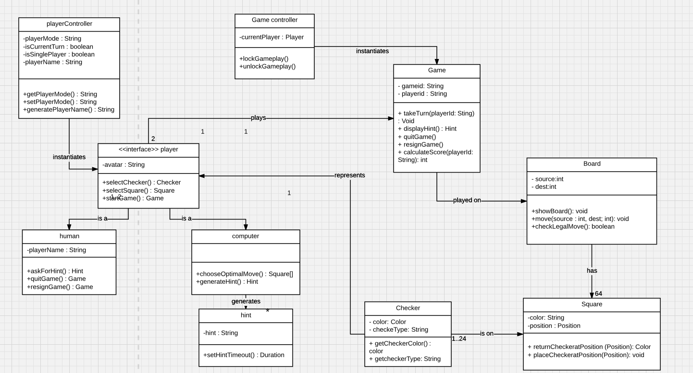
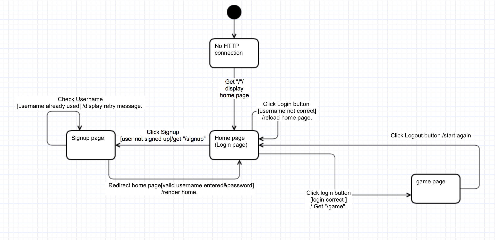
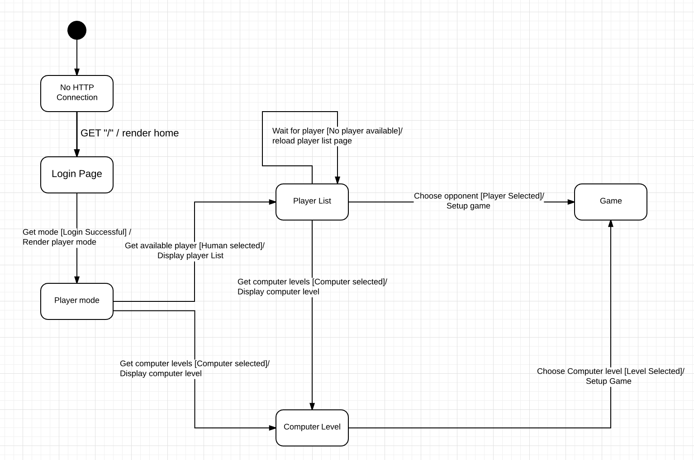

# Table of Contents
- [Web Checkers Design Documentation](#project-design-documentation)
  * [Executive Summary](#executive-summary)
    + [Purpose](#purpose)
    + [Glossary and Acronyms](#glossary-and-acronyms)
  * [Requirements](#requirements)
    + [Definition of MVP](#definition-of-mvp)
    + [MVP Features](#mvp-features)
    + [Roadmap of Enhancements](#roadmap-of-enhancements)
  * [Application Domain](#application-domain)
    + [Overview of Major Domain Areas](#overview-of-major-domain-areas)
    + [Details of each Domain Area](#details-of-each-domain-area)
  * [Application Architecture](#architecture)
    + [Summary](#summary)
    + [Overview of User Interface](#overview-of-user-interface)
    + [Tier X](#tier-x)
  * [Sub-system X](#sub-system-x)
    + [Purpose of the sub-system](#purpose-of-the-sub-system)
    + [Static models](#static-models)
    + [Dynamic models](#dynamic-models)

# Web Checkers Design Documentation

## Executive Summary

This is a summary of the project.

### Purpose
This   software   design   document   describes   the   architecture   and   system   design   of   the   WebCheckers webapp   game.

### Glossary and Acronyms

| Term | Definition |
|------|------------|
| SOA | Service Oriented Architecture|
| AI | Artificial Intelligence |
| DAO | Data Access Object |

## Requirements

This section describes the features of the application.

### Definition of MVP
MVP stands for Minimum Viable Product. MVP are all the stories required to be completed in the first release. In other words, MVP is the product with enough features to satisfy customers and to provide feedback for future developments.

### MVP Features
The   general   functionality   of   the   project   is   to   provide   the   user   with   a   web   interface   that   allows users   to   play   the   game   of   checkers.   Standard   features   will   include:

* New   player   sign-up
* Existing   player   sign-in
* Player   sign-out
- Asynchronous   checkers   gameplay   including:
- Play   against   another   human
- Checker capture
- Kings
- Player   request   queues
- Game   options   including
* Back   up   one   move
* Reset   turn
* Submit   turn
* Quit   after   a   game
* Resign   during   a   current   game

### Roadmap of Enhancements
Future   features   may   include:

* Gameplay   against   the   computer
* Hint   requests   from   computer   opponent
* Selecting   difficulty   level   for   computer   opponent
* Saving   games
* Post-game   review
* Public   player   profiles   with   game   history   stats

## Application Domain

This section describes the application domain.

### Overview of Major Domain Areas
Domain entities and their associations for the applications are identified. These can be represented as domain model as shown in figure.

### Details of each Domain Area
Board, player, checker, square, game are important domain entities in the application. The line connecting the domain entities in above diagram indicates the relationship between the entities in its domain.

Above domain model tells us about following:

* **Game** is played on the **board**.
* **Board** contains  ** 64 squares**.
* **Square** can have color and position.
* **Checker** is placed on **Square**.
* There are total **24 Checkers** in **64 Square** of the **Board**.
* **Checker** represents the **player**.
* **Players** play **game** on **board**.

## Architecture

This section describes the application architecture.

### Summary
Service-oriented   architecture   approach   was   implemented   to   provide   abstraction   and separate   concerns   by   calling   service   classes   inside   controllers.   The   services   act   as   an abstraction   for   the   DAO   interface   implementation   classes,   which   serve   to   avoid   invoking any   persistence   mechanisms   directly   from   the   UI   controllers.
Project   Packages

* Models
* UI   Controllers
* Controllers
* Services
* DAO

### Overview of User Interface
Web Checker has multiple state that redirects user to appropriate interface. On high level, User interface can be divided into two state models:

* User Interface based on Login State
User can have three states: logged in, logged out and signed up. Considering these states, following diagram shows the state chart diagram describing the login phase.

* User Interface based on Player Mode
Player mode can have two states: human and computer. Considering these states, following diagram shows the state chart diagram describing the player mode scenario.

### Tier UI

UI Tier facilitates the interaction of user with the application. UI Tier provides user with appropriate views and allow users to perform some actions on the view itself. In case of this application, UI Tier is responsible for creating login pages, game pages, allowing user to play the game. For web checkers, Freemarker Template is used to generate html pages. UI tier can be broadly classified into two subsystems.

#### Sub-system UI View
##### Purpose of the sub-system

#### Sub-system UI Controller
##### Purpose of the sub-system

#### Tier Controller
#### Tier Model
#### Tier Service
#### Tier DAO

### Static models
> Provide one or more static models (UML class or object diagrams) with some details such as critical attributes and methods.  If the sub-system is large (over 10 classes) then consider decomposing into multiple, smaller, more focused diagrams.

### Dynamic models
> Provide any dynamic model, such as state and sequence diagrams, as is relevant to a particularly significant user story.
> For example, in WebCheckers you might create a sequence diagram of the `POST /validateMove` HTTP request processing or you might use a state diagram if the Game component uses a state machine to manage the game.

