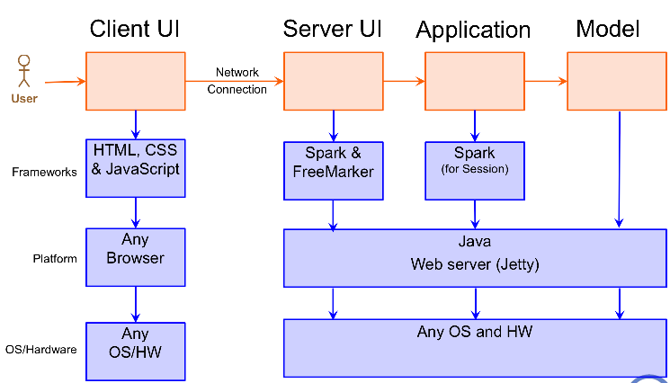
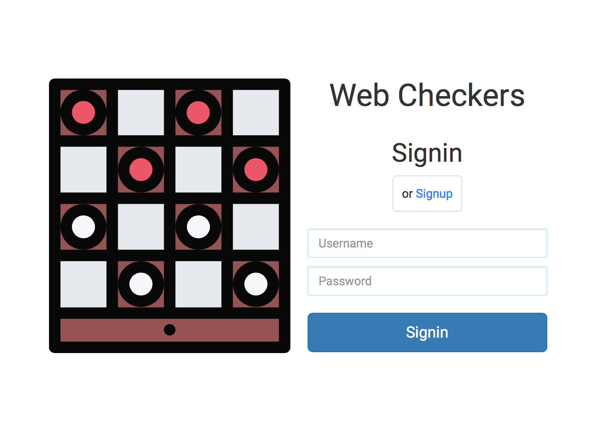
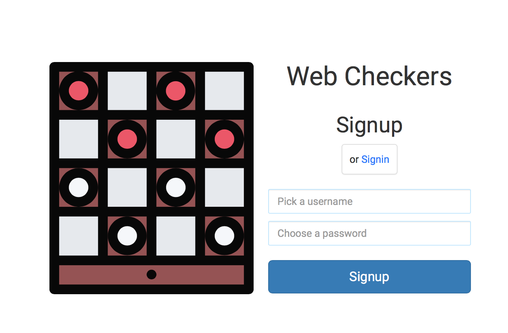
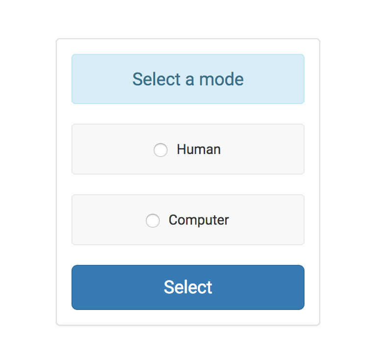
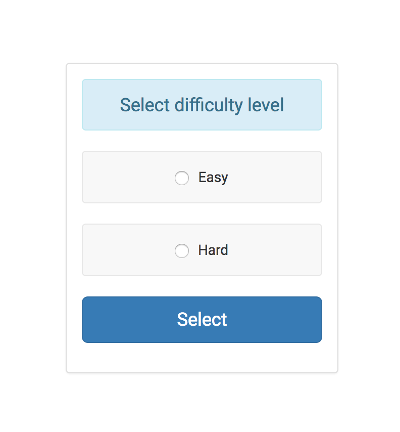
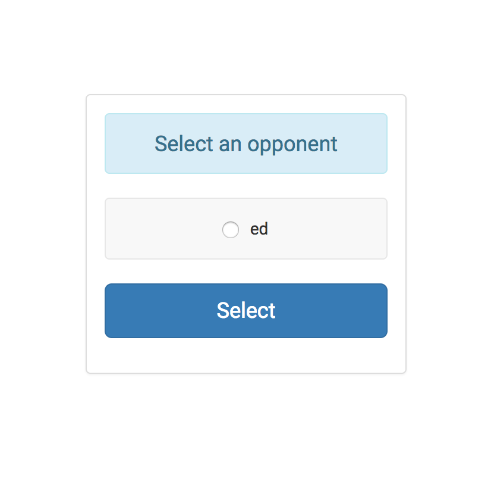
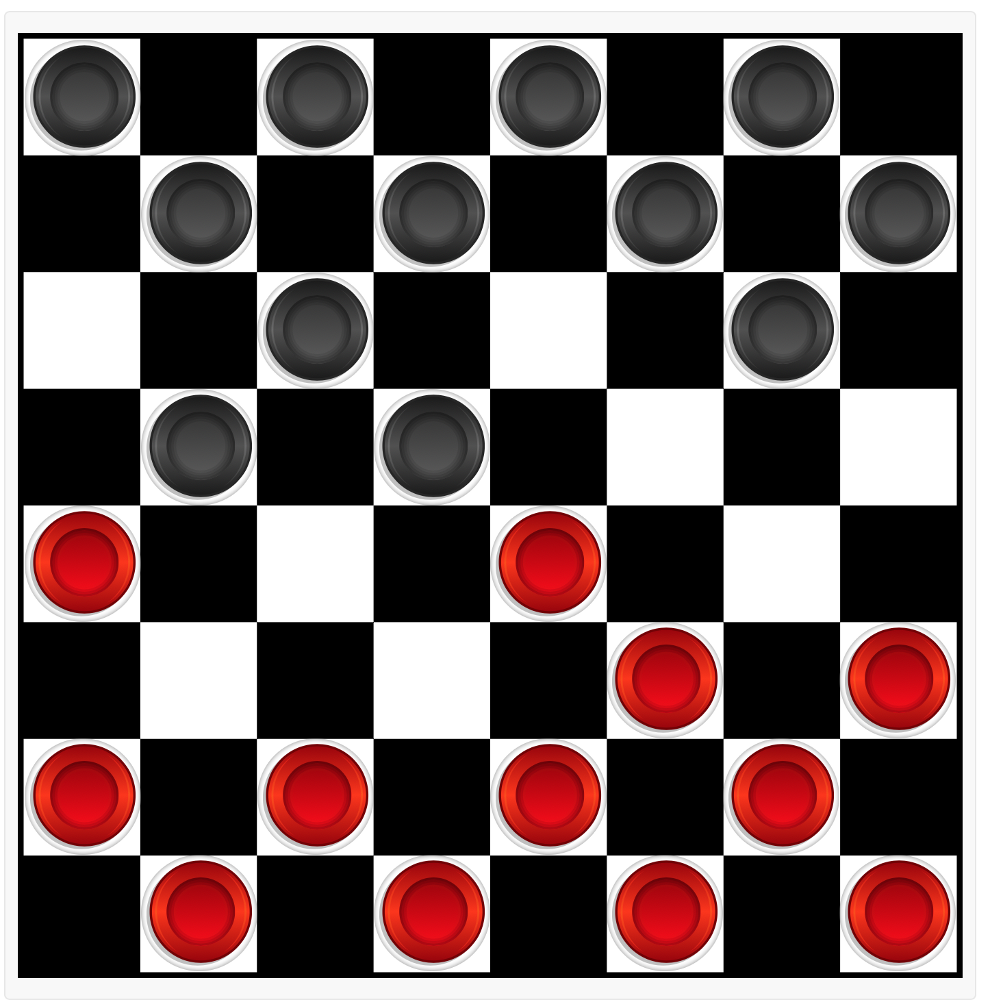
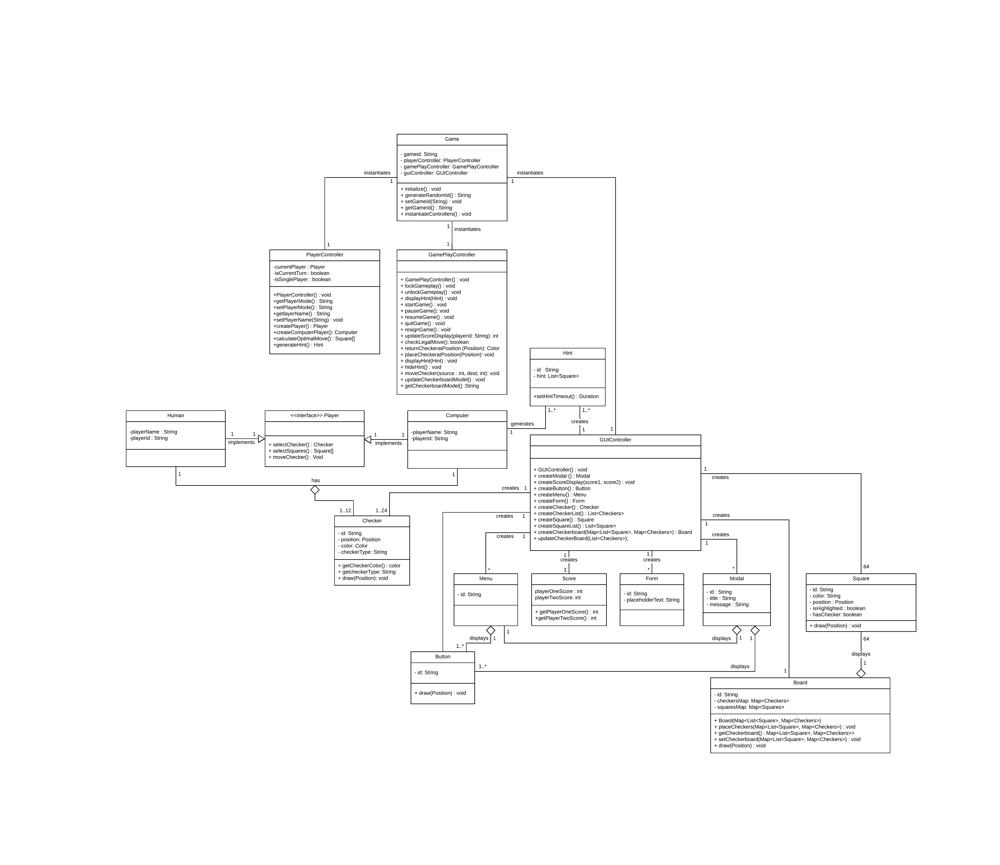
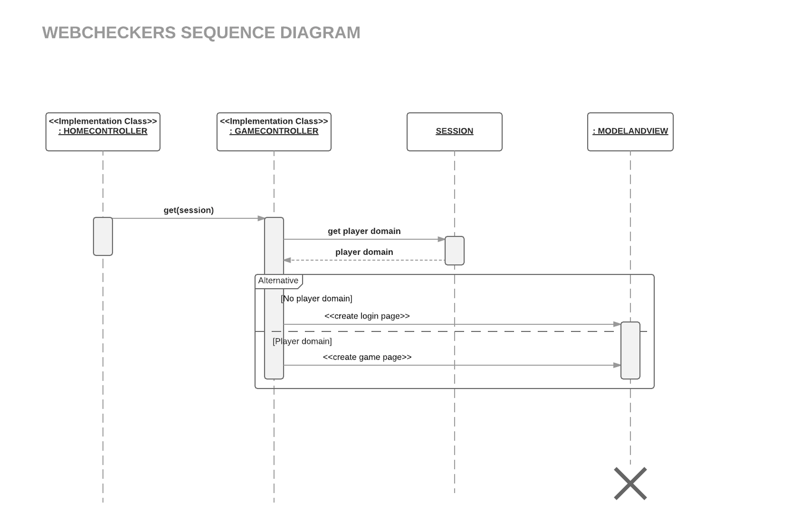
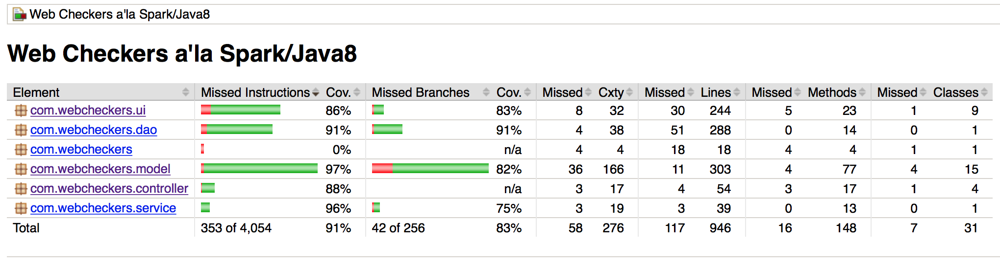

---
output:
  html_document: default
  pdf_document: default
---

# Web Checkers Design Documentation

## Table of Contents
  * [Executive Summary](#executive-summary)
    + [Purpose](#purpose)
    + [Glossary and Acronyms](#glossary-and-acronyms)
  * [Requirements](#requirements)
    + [Definition of MVP](#definition-of-mvp)
    + [MVP Features](#mvp-features)
    + [Roadmap of Enhancements](#roadmap-of-enhancements)
  * [Application Domain](#application-domain)
    + [Overview of Major Domain Areas](#overview-of-major-domain-areas)
    + [Details of each Domain Area](#details-of-each-domain-area)
  * [Application Architecture](#architecture)
    + [Summary](#summary)
    + [Overview of User Interface](#overview-of-user-interface)
    + [Tier X](#tier-x)
  * [Sub-system X](#sub-system-x)
    + [Purpose of the sub-system](#purpose-of-the-sub-system)
    + [Static models](#static-models)
    + [Dynamic models](#dynamic-models)
  * [Unit Test and Code Coverage](#unit-test-and-code-coverage)

## Executive Summary

Web Checkers game is a multiplayer web application where players registers and signin to join player queue or play against computer. The application must allow players to play checkers with other players who are currently signed-in. The game user interface (UI) will support a game experience using drag-and-drop browser capabilities for making moves.

Beyond this minimal set of features, we have grand vision for what we could do including watching live games, playing multiple games, playing games asynchronously, reviewing past games, running tournaments with timed moves, and offering AI players to compete against.

### Purpose
This   software   design   document   describes   the   architecture   and   system   design   of   the   WebCheckers webapp   game.

### Glossary and Acronyms

| Term | Definition |
|------|------------|
| SOA | Service Oriented Architecture|
| AI | Artificial Intelligence |
| DAO | Data Access Object |

## Requirements

This section describes the features of the application.

### Definition of MVP
MVP stands for Minimum Viable Product. MVP are all the stories required to be completed in the first release. In other words, MVP is the product with enough features to satisfy customers and to provide feedback for future developments.

### MVP Features
The   general   functionality   of   the   project   is   to   provide   the   user   with   a   web   interface   that   allows users   to   play   the   game   of   checkers.  

The minimal viable product includes these features:

1. Every player must sign-in before playing a game.
2. Two players must be able to play a game of checkers based upon the American rules.
3. Either player of a game may choose to resign, which ends the game.

MVP features can be divided into multiple epics or stories:

* New   player   sign-up
* Existing   player   sign-in
* Player   sign-out
* Asynchronous   checkers   gameplay   including:
    - Play   against   another   human
    - Checker capture
    - Kings
    - Player   request   queues
    - Game   options   including
        * Back   up   one   move
        * Reset   turn
        * Submit   turn
        * Quit   after   a   game
        * Resign   during   a   current   game

### Roadmap of Enhancements
Future   features   may   include:

* Gameplay   against   the   computer
    * Hint   requests   from   computer   opponent
    * Selecting   difficulty   level   for   computer   opponent
* Saving   games
* Post-game   review
* Public   player   profiles   with   game   history   stats

## Application Domain

This section describes the application domain.

### Overview of Major Domain Areas
Domain entities and their associations for the applications are identified. These can be represented as domain model as shown in figure.

### Details of each Domain Area
Board, player, checker, square, game are important domain entities in the application. The line connecting the domain entities in above diagram indicates the relationship between the entities in its domain.

Above domain model tells us about following:

* **Game** is played on the **board**.
* **Board** contains  **64 squares**.
* **Square** can have color and position.
* **Checker** is placed on **Square**.
* There are total **24 Checkers** in **64 Squares** of the **Board**.
* **Checker** represents the **player**.
* **Players** play **game** on **board**.

## Architecture

This section describes the application architecture.

### Summary
Service-oriented   architecture   approach   was   implemented   to   provide   abstraction   and separate   concerns   by   calling   service   classes   inside   controllers.   The   services   act   as   an abstraction   for   the   DAO   interface   implementation   classes,   which   serve   to   avoid   invoking any   persistence   mechanisms   directly   from   the   UI   controllers.
Project   Packages

#### Model
Model contains the logic of the game. Classes like Board, Player, Checker, Squares defines the main logic of the game. 

#### Controller
Controller controls the flow of the application. Controllers serves the request from UI by taking the response from the model. It act as a mediator between Model and UI.

#### View (UI View and UI Controllers)
UI defines the interfaces and the interaction of user with the application. UI view is responsible for displaying web pages whereas UI controller is responsible for handling the request from user and make appropriate method call to controller.

#### DAO
DAO layer creates a persistence mechanism to write the information to file.

#### Service
Service layer provides abstraction to DAO interface to avoid   invoking any   persistence   mechanisms   directly   from   the   UI   controllers.

### Overview of User Interface
User interface controls how user interacts with the application. Web Checkers game has login, singup, player mode and game page interfaces where user can interact with the systems. User Interfaces in this application are:

#### Login Interface

Login interface provides user with the interface to log into the application. This interface provides appropriate feedback to the user when user interacts with the system.

#### Signup Interface

Sigup interface provides user with the interface to register into the application. This interface also provides appropriate feedback to the user when user interacts with the system.

#### Player Mode

Web checker application provides interfaces to select to play against computer or human. If computer is selected as an opponent, level of difficulty should be chosen. However, if human opponent is selected, list of opponent is displayed and an opponent should be selected.

| Mode | Computer | Human Opponent |
|------|------------|------------|
|  | | |

#### Game Interface

Game interface provides information related to game. User is provided with the options to sign out from the game. There is a section in the interface where you can see the score of the players and also the information indicating the turn to move checkers among the players. Game page provides buttons to control the game. User can perform activities like backup one move, reset turn, submit turn, and resign the game using these buttons.

At the start of the game, board is initialized with 64 black and white squares with 24 checkers. Each player is indicated by the color of the checkers. Each player has 12 checkers initially placed at diagonal position of the board.

### Tier UI

UI Tier facilitates the interaction of user with the application. UI Tier provides user with appropriate views and allow users to perform some actions on the view itself. In case of this application, UI Tier is responsible for creating login pages, game pages, allowing user to play the game. For web checkers, Freemarker Template is used to generate html pages. UI tier can be broadly classified into two subsystems.

#### Sub-system UI View
##### Purpose of the sub-system

#### Sub-system UI Controller
##### Purpose of the sub-system

#### Tier Controller
#### Tier Model
#### Tier Service
#### Tier DAO

### Static models

### Dynamic models
Web Checker has multiple state that redirects user to appropriate interface. On high level, User interface can be divided into two state models:

#### User Interface based on Login State

User can have three states: logged in, logged out and signed up. Considering these states, following diagram shows the state chart diagram describing the login phase.

#### User Interface based on Player Mode

Player mode can have two states: human and computer. Considering these states, following diagram shows the state chart diagram describing the player mode scenario.

#### Sequence diagrams

## Unit Test and Code Coverage
Unit testing is the integral part of the software development. To ensure high quality software, each component of the software must be tested. Unit testing allows to test each component in isolation from other components that it depends on.

Following diagram shows the code coverage report from Jacoco.

